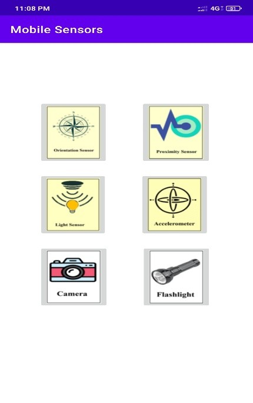
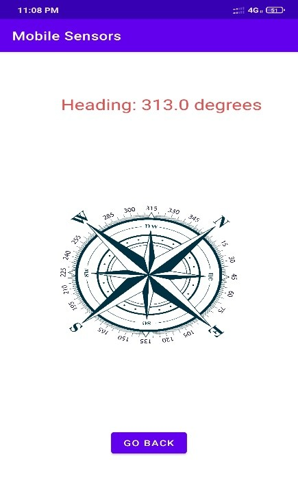
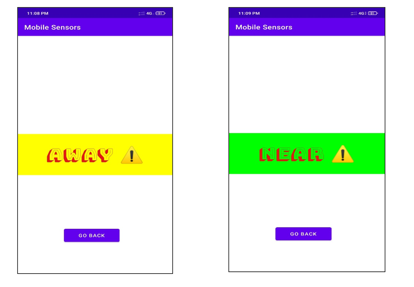
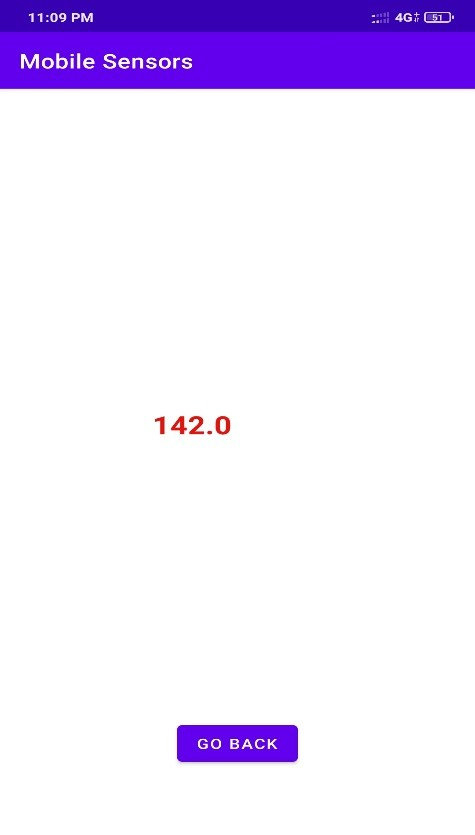
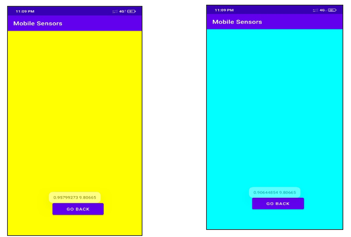
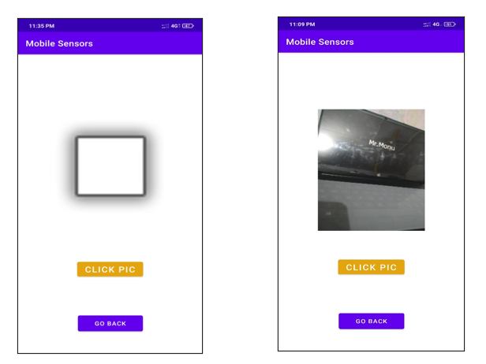
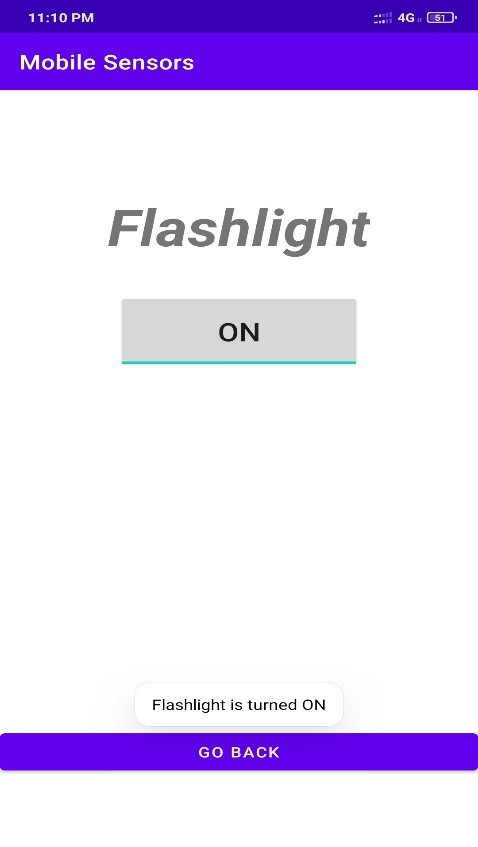

# 📱 Android Mobile Sensor Tester

A feature-rich Android application developed using **Java** and **Android Studio** to test and interact with various built-in smartphone sensors. The application provides an easy-to-use interface for checking the functionality of common mobile sensors and hardware components in real time.

---

## 📖 Project Overview

Modern smartphones contain multiple sensors that support navigation, gaming, photography, automation, and user interaction. This application provides a simple interface to verify whether these sensors and hardware components are functioning correctly.

The app enables users to test different sensors individually and view their real-time output, making it useful for learning Android sensor APIs as well as diagnosing hardware functionality.

---

## ✨ Features

- 🧭 Orientation (Compass) Sensor
- 📡 Proximity Sensor
- 💡 Light Sensor
- 📳 Accelerometer Sensor
- 📷 Camera Testing
- 🔦 Flashlight Control
- 📱 Simple and User-Friendly Interface
- ⚡ Real-Time Sensor Data Display

---

## 📸 Application Screenshots

### Home Screen

<p align="center">

</p>

---

### Orientation Sensor

<p align="center">

</p>

---

### Proximity Sensor

<p align="center">

</p>

---

### Light Sensor

<p align="center">

</p>

---

### Accelerometer

<p align="center">

</p>

---

### Camera

<p align="center">

</p>

---

### Flashlight

<p align="center">

</p>

---

## 🛠️ Technologies Used

- Java
- Android Studio
- Android SDK
- XML
- Android Sensor API
- Camera API
- Flashlight API

---

## 📱 Supported Sensors

| Feature | Description |
|---------|-------------|
| Orientation Sensor | Displays device heading using the compass sensor |
| Proximity Sensor | Detects nearby objects |
| Light Sensor | Displays ambient light intensity |
| Accelerometer | Detects movement and acceleration |
| Camera | Captures images using the device camera |
| Flashlight | Turns the device flashlight ON/OFF |

---

## 📂 Project Structure

```
Mobile-Sensor-Tester
│
├── app/
├── Images/
│   ├── HomeScreen.jpg
│   ├── OrientationSensor.jpg
│   ├── ProximitySensor.jpg
│   ├── LightSensor.jpg
│   ├── Accelerometer.jpg
│   ├── Camera.jpg
│   └── Flashlight.jpg
│
├── Documentation/
│   └── Mobile_Sensor_Tester_Report.pdf
│
├── APK/
│   └── MobileSensorTester.apk
│
├── README.md
├── LICENSE
└── .gitignore
```

---

## 🚀 Getting Started

### Clone Repository

```bash
git clone https://github.com/yourusername/Mobile-Sensor-Tester.git
```

### Open Project

1. Open Android Studio.
2. Select **Open Existing Project**.
3. Choose the project folder.
4. Sync Gradle.
5. Run on an Android device or emulator.

---

## 🎯 Learning Outcomes

- Android Activity Lifecycle
- Android Sensor Framework
- Camera Integration
- Flashlight Control
- Event Handling
- XML Layout Design
- Android UI Development
- Java Programming

---

## 🚀 Future Enhancements

- Gyroscope Sensor
- Magnetometer
- Barometer
- GPS Testing
- Microphone Testing
- Fingerprint Sensor
- Sensor Health Report
- Material Design UI
- Dark Mode
- Export Sensor Data

---

## 👨‍💻 Author

**Mohan Ugale**

Diploma in Computer Technology 

K. K. Wagh Polytechnic, Nashik

---

## ⭐ If you found this project useful, consider giving it a Star!
